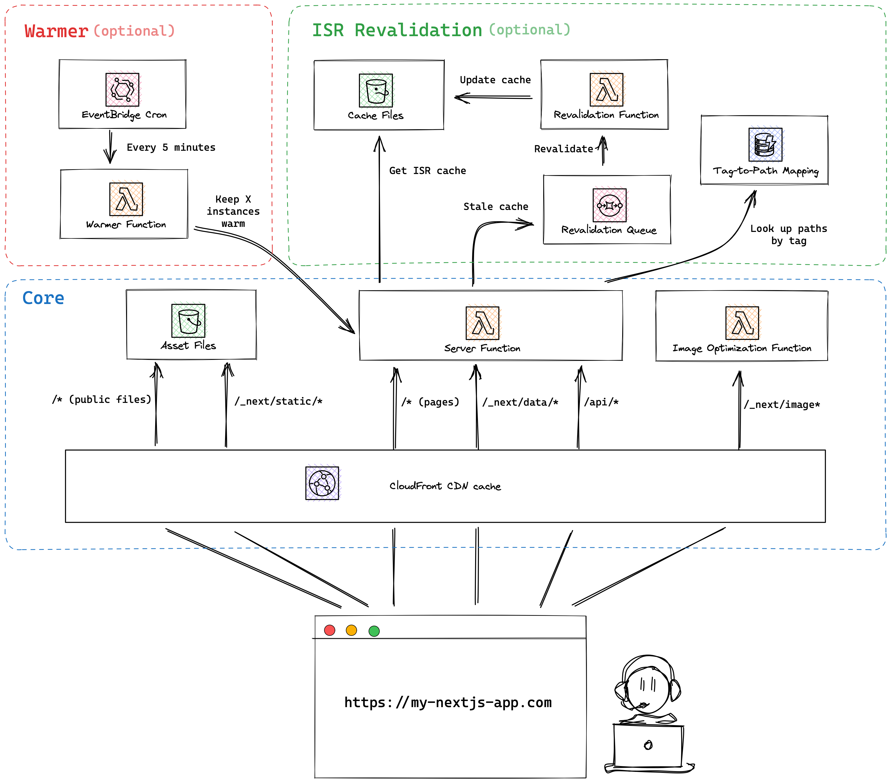

# Proof of Concept: Serverless Next.js (page router) Application on AWS using [cdk-nextjs](https://github.com/jetbridge/cdk-nextjs/)

Aaron Medina | [GitHub](https://github.com/aaronmedina-dev) | [Linkedin](https://www.linkedin.com/in/aamedina/)

## Overview

This guide explains how to deploy a Next.js (page router) application on AWS with **cdk-nextjs-standalone**. It supports:

- **Server-side rendering (SSR)** for dynamic content.
- **Dynamic routing** for flexible URLs.
- **Image optimization** for performance.
- **Static assets** such as JSON files, served via CloudFront
- **Warmer Function** Sends requests to configured endpoints to keep their corresponding Lmabda functions "warm".
- **Incremental Static Regeneration (ISR)** Updates pre-rendered pages at runtime.

The architecture leverages **AWS Lambda**, **CloudFront**, and **S3** to provide a scalable and serverless deployment.

### How Warmer Works

The warmer components consist of:

- **Warmer Lambda Function**: Sends periodic `GET` requests to endpoints (SSR, ISR, API routes) to keep their corresponding Lambda functions "warm."
- **EventBridge Rule**: Acts as a scheduler, triggering the warmer Lambda function every 5 minutes (configurable).
- **Integration**: The warmer targets endpoints served through CloudFront, ensuring that both Lambda functions and cached content remain up-to-date.

I added two (2) ways of adding the warmer function:
1. Using the open-next warmer-function
2. Using custom warmer-function.
    Paths should be added to `WARMER_PATHS:` separated by comma (,).

We have added here a Warmer Lambda Function and Eventbridge rule for invoking the Lambda function every X minutes.

### How ISR Works

**Initial Build**

- When you deploy your Next.js app, pages specified in getStaticPaths are statically generated and stored.

**On Request**

- If a request is made to a page:
    - If it’s already generated, the cached version is served.
    - If the page is not generated (fallback: true or blocking), it will be rendered on the fly and cached.

**Revalidation**

- The revalidate property defines the time in seconds to wait before the next regeneration.
- If a request comes after the revalidate time has passed:
    - A new version of the page is generated in the background (for revalidate).

**Serving Pages**

- While the new page is being regenerated, the cached version is served to avoid downtime.
- Once the new page is ready, subsequent requests will get the updated version.

<br><br><br><br>

We also have a guide creating this PoC ground up, resource can be found [here](ground-up%20guide.md)

## 📝 A Few Notes

I’m sure that in this PoC, I’m not following the best practices.

There are a few hard-coded parts to just make it work quicker.

There are a few more that I have not tried like testing ISR for pages connected to DB, etc. I decided to use the simplest way to demonstrate/test a feature.

I added all static resource in `public` folder.

Need to fix ESLint.

I used page router in this PoC, I know I should’ve used the app router 🤦‍♂️

## References
- [Next.js Documentation](https://nextjs.org/docs)
- [OpenNext Documentation](https://opennext.js.org/)
- [AWS CDK Documentation](https://docs.aws.amazon.com/cdk/latest/guide/home.html)
- [cdk-nextjs-standalone GitHub](https://github.com/jetbridge/cdk-nextjs/)
- [cdk-nextjs-standalone ConstructHub](https://constructs.dev/packages/cdk-nextjs-standalone/)

## Recommended Set-up from [OpenNext](https://opennext.js.org/aws/inner_workings/architecture)



More information about the components [here](https://opennext.js.org/aws/inner_workings/architecture)

## PoC Output


# Project Setup and Deployment Guide

## Prerequisites

### Required Tools

- **Git**: To clone the repository.
- **AWS CLI**: For deploying resources to AWS.
- **Node.js**: To run and build the Next.js app.
- **AWS CDK**: To define and deploy the infrastructure.

### Setup Commands

1. Install AWS CLI and configure it:
   ```bash
   aws configure
   ```

2. Install Node.js (LTS version) and AWS CDK:
   ```bash
   npm install -g aws-cdk
   ```

3. Verify installations:
   ```bash
   aws --version
   node -v
   cdk --version
   ```

---

## Step 1: Clone the Repository

1. Clone the repository:
   ```bash
   git clone https://github.com/aaronmedina-dev/cdk-nextjs-standalone-poc.git
   ```

2. Navigate to the project directory:
   ```bash
   cd cdk-nextjs-standalone-poc
   ```

---

## Step 2: Install Dependencies

1. Navigate to the Next.js app directory:
   ```bash
   cd nextjs-app
   ```

2. Install the necessary dependencies:
   ```bash
   npm install
   ```

---

## Step 3: Test locally the Next.js Application

1. Run the Next.js application in standalone mode:
   ```bash
   npm run dev
   ```

2. Visit link showed in your terminal

---

## Step 4: Deploy to AWS Using CDK

1. Navigate back to the root project directory:
   ```bash
   cd ..
   ```

2. Bootstrap your AWS environment (if not already done):
   ```bash
   cdk bootstrap
   ```

3. Deploy the CDK stack:
   ```bash
   cdk deploy
   ```

4. Note the CloudFront domain name from the deployment output. It will be used to access your application.

5. ⚠️ This is a **technical debt**, once you have the CF domain name, update the domain in `[id].tsx` then redeploy cdk.

---

## Step 5: Testing

### Core Components

1. **Homepage**: Visit `https://<cloudfront-id>/`.

2. **Server-Side Rendering (SSR)**: Visit `https://<cloudfront-id>/ssr`.

3. **Dynamic Route**: Visit `https://<cloudfront-id>/dynamic/example`.

4. **API Route**: Test the API using a browser or `curl`:
   ```bash
   curl "https://<cloudfront-id>/api/hello?name=YourName"
   ```

5. **Image Optimization**: Test image optimization via the homepage or use the `_next/image` endpoint:
   ```perl
   https://<cloudfront-id>/_next/image?url=%2Ftest-image.jpg&w=500&q=75
   ```

6. **/_next/static/**: `https://<your-cloudfront-id>/dynamic/page-ssr?slug=test`
    
    The JSON file should contain:

    ```json
    {
      "pageProps": {
          "data": "Dynamic SSR content for slug: test"
      }
    }
    ```

    You can also open your browser’s developer tools and look at the Network tab. Find the /_next/static/* request, which serves the JSON file for this page.


7. **Static File**: Static data has been consumed in Homepage.

### Warmer Components

1. Manual Invocation

    - Locate the `*WarmerFunction*` in Lambda.
    
    - Use the Test feature to invoke the function

2. Via AWS-Events Rule, will depend on the schedule that you will set in `lib/serverless-nextjs-poc-stack.ts`

2. Check Logs

### ISR Components

1. Initial Build and Deployment

    Deploy the application and access /isr-test/1. Note the content.

2. Content Update

    Modify posts.json to update the content for ID 1.

3. Access During Revalidation:

    Access /isr-test/1 before 60 seconds. You should still see the old content.

4. Post-Revalidation

    Wait for 60 seconds and access the page again. The new content should appear.

    The 60 seconds wait time is based on the `revalidate: 60` configuration set in `[id].tsx`

5. Test Fallback Behavior:

    Access /isr-test/3 (not pre-rendered). Confirm that the page is generated dynamically.

    Cache folder in S3 should not have an object for `/isr-test/3`

6. Manual Revalidation (OPTIONAL - if API is added)

    Add the revalidation API endpoint mentioned above.

    Trigger the endpoint for /isr-test/1 after updating posts.json and verify that the page updates without waiting for 60 seconds.

    ```bash
    curl -X POST "https://<your-cloudfront-domain>/api/revalidate?secret=my-secret-token&path=/isr-test/<id>"
    ```

    Check bucket if cache is created.

---

## Common Issues and Solutions

### Image Optimization Errors

- Ensure the `next.config.js` file is properly configured with allowed widths and sizes.

### CloudFront Cache Updates

- If changes are not reflected, invalidate the CloudFront cache:
  ```bash
  aws cloudfront create-invalidation --distribution-id <CLOUDFRONT_ID> --paths "/*"
  ```

